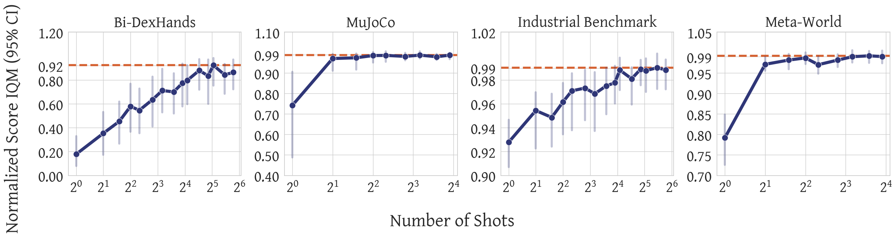

# Vintix: Action Model via In-Context Reinforcement Learning

[](LICENSE)
[](https://arxiv.org/abs/2501.19400)

An official implementation for [Vintix: Action Model via In-Context Reinforcement Learning](https://arxiv.org/abs/2501.19400) — a cross-domain model capable of learning behaviors through in-context reinforcement learning.




## Load Training Data
The Vintix training dataset is hosted on a public S3 bucket and is freely available to everyone under the CC BY-SA 4.0 License.

You can download the dataset using the curl utility (or alternatives like wget). Be sure to unzip the downloaded file before use.
```shell
# approx 130GB size
curl -L -o VintixDataset.zip https://tinyurl.com/426ckafn

unzip VintixDataset.zip
```


### Dataset Structure

The dataset consists of multiple .h5 files, each corresponding to a single trajectory in a specific environment. Each file is divided into groups of 10,000 steps (the last group in a trajectory may contain fewer). These groups contain the following keys:
- `proprio_observation`: The sequence of observations (`np.float32`)
- `action`: The sequence of actions taken in the environment (`np.float32`)
- `reward`: The sequence of rewards received after each action (`np.float32`)
- `step_num`: The sequence of step numbers within each episode (`np.int32`)

For more details on the collected trajectories, please refer to our [paper](https://arxiv.org/abs/2501.19400).

## Training Vintix
Train your Vintix model (run on 8xH100)

1. Clone this repository
  ```shell
  git clone https://github.com/dunnolab/vintix.git
  ```
2. Prepare Python environment following [this](docker/train) instruction
3. Update the `data_dir` parameter in the [train configuration file](vintix/scripts/train/configs/train_config.yaml) to the directory where the downloaded dataset was unpacked
4. Update the `save_dir`parameter in the [train configuration file](vintix/scripts/train/configs/train_config.yaml) to the directory where you want to save the model checkpoints
5. Run the following command from vintix directory:
  ```shell
  export WORLD_SIZE=$(nvidia-smi -L | wc -l)

  cd vintix
  OMP_NUM_THREADS=1 torchrun \
    --standalone \
    --nnodes=1 \
    --nproc-per-node=$WORLD_SIZE \
    --module scripts.train \
    --config_path vintix/scripts/train/configs/train_config.yaml
  ```


## Model Performance

Detailed information about the model’s performance on each task across all domains (MuJoCo, Meta-World, Bi-DexHands, Industrial Benchmark) can be found in [EVAL.md](EVAL.md).

## Usage Examples
To get started with Vintix, follow the next steps:

1. Prepare Python environment following [this instruction](docker/mujoco_metaworld_validation/)
2. Clone this repository
  ```shell
  git clone https://github.com/dunnolab/vintix.git
  ```
3. Install Vintix
  ```shell
  cd vintix
  pip3 install -e .
  ```
4. Download checkpoint from [hugginface](https://huggingface.co/dunnolab/Vintix)
 ```shell
 pip3 install hugginface_hub
 ```
 ```python
 from huggingface_hub import snapshot_download

 snapshot_download(repo_id="dunnolab/Vintix",
                   local_dir="/path/to/checkpoint")
 ```
5. Use it. You can find simple usage example below or find more examples [here](scripts/eval/)

```python
import torch
import metaworld
import gymnasium as gym
from vintix import Vintix


PATH_TO_CHECKPOINT = "/path/to/checkpoint"
model = Vintix()
model.load_model(PATH_TO_CHECKPOINT)
model.to(torch.device('cuda'))
model.eval()

# task_name = "Humanoid-v4"
task_name = "shelf-place-v2"
env = gym.make(task_name)
model.reset_model(task_name,
                  use_cache=True,
                  torch_dtype=torch.float16)
max_env_steps = 50

episode_rewards = []
for step in range(max_env_steps):
    cur_ep_rews = []
    observation, info = env.reset()
    reward = None
    done = False
    while not done:
        action = model.get_next_action(observation=observation,
                                       prev_reward=reward)
        observation, reward, termined, truncated, info = env.step(action)

        done = termined or truncated
        cur_ep_rews.append(reward)
    episode_rewards.append(sum(cur_ep_rews))
print(f"Rewards per episode for {task_name}: {episode_rewards}")
```
It’s worth mentioning that Vintix was trained and tested on Mujoco environments in version ‘v4’ (e.g., Ant-v4, Pusher-v4) and Meta-World environments in version ‘v2’ (e.g., assembly-v2, shelf-place-v2).


### Other Domains
To validate the model on other domains, please use the links below.
- Bi-DexHands: [Docker Image](docker/bidexhands_validation), [Code Snippet](docker/industrial_benchmark_validation/README.md), [Environment](envs/wrappers/bidexhands.py)
- Industrial Benchmark: [Docker Image](docker/industrial_benchmark_validation), [Code Snippet](docker/industrial_benchmark_validation/README.md), [Environment](envs/wrappers/industrial_benchmark.py)


## Citation

If you would like to cite our work, please use the following bibtex

```bibex
@article{polubarov2025vintix,
  author={Andrey Polubarov and Nikita Lyubaykin and Alexander Derevyagin and Ilya Zisman and Denis Tarasov and Alexander Nikulin and Vladislav Kurenkov},
  title={Vintix: Action Model via In-Context Reinforcement Learning},
  journal={arXiv},
  volume={2501.19400},
  year={2025}
}
```
